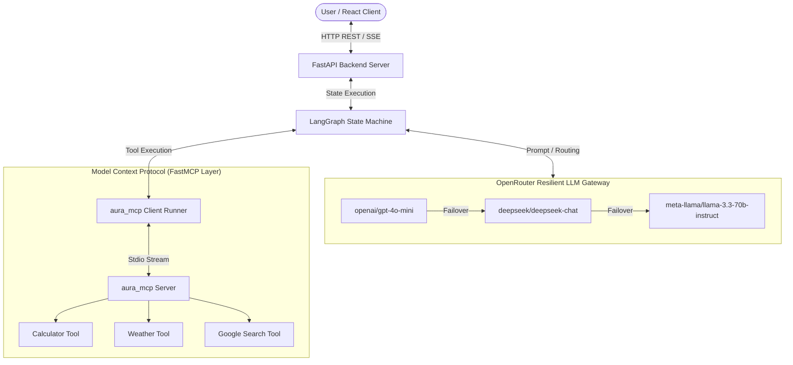

# ⚡ Aura AI Companion

An intelligent, context-aware AI companion built with **FastAPI**, **LangGraph**, **FastMCP (Model Context Protocol)**, and a glassmorphic **React (Vite)** web workspace.


---

## 🌟 Features Overview

### 1. ⚡ Model Context Protocol (MCP) Integration
- Built with **FastMCP** (`aura_mcp/`) exposing local functions as standard MCP tools over Stdio.
- Decoupled server/client execution pipeline allowing external MCP clients (Claude Desktop, custom agents, VSCode extensions) to connect seamlessly.

### 2. 🛡️ Resilient Multi-Provider LLM Chain
- **Automatic Fallback Hierarchy**: Routes all requests through OpenRouter with unified tool bindings across all models:
  $$\text{Primary: } \texttt{meta-llama/llama-3.3-70b-instruct} \longrightarrow \text{Fallback 1: } \texttt{openai/gpt-4o-mini} \longrightarrow \text{Fallback 2: } \texttt{deepseek/deepseek-chat}$$
- **Tool-Bound Resilience**: Tools are bound to both primary and fallback models before assembling fallbacks, ensuring zero tool loss during failovers.
- **Safe Token Management**: Configured token bounds (`max_tokens=2048`) to prevent credit threshold rejection errors.

### 3. 🛠️ Intelligent Tool Suite
- 🧮 **Calculator Tool**: Evaluates arithmetic (`(100 - 25) / 5`) and solves single-variable algebraic equations using SymPy (`20 - (x + x + 6) = 0`).
- 🌤️ **High-Precision Weather Tool**: 
  - Dual-geocoding via **OpenStreetMap (Nominatim)** & Open-Meteo for 100% precision across cities, states (`Goa`), and small towns/villages (`Maredumilli`).
  - Multi-location parsing (e.g. `"Goa and Maredumilli"`).
- 🔍 **Google Search Tool**: Real-time live data, breaking news, and organic web results via SerpAPI.

### 4. 🧠 Turn-Isolated Context & Memory
- **Per-Turn Tool Scoping**: Filters tool execution history to the current message turn, preventing past tool badges from leaking into new responses.
- **Smart Cache Bypass**: Dynamically bypasses static semantic response cache for real-time tool queries (`weather`, `search`, `calculate`).
- **Long-Term Memory**: Automatic extraction and storage of long-term user facts and preferences.

### 5. 🎨 Glassmorphic React Frontend
- **Real-Time Badges**: Displays execution badges above AI responses (`⚡ fetch_weather("Goa, India") via FastMCP`).
- **Response Action Bar**: One-click Copy, Thumbs Up/Down feedback, and instant "Try again" regeneration.
- **Thread History**: Full chat thread management with persistent local and database history.

---

## 🏗️ System Architecture



---

## 📂 Project Structure

```
Aura/
├── aura/
│   ├── api/             # FastAPI endpoints, schemas, and router
│   ├── core/            # LangGraph nodes, state graph, and resilient LLM factory
│   ├── memory/          # Semantic cache, fact store, and memory extractor
│   └── tools/           # Core tool functions (calculator, weather, search)
├── aura_mcp/
│   ├── mcp_server.py    # FastMCP server registering aura tools over Stdio
│   └── mcp_client.py    # FastMCP client runner and execution wrappers
├── frontend/
│   ├── src/
│   │   ├── App.jsx      # React workspace, thread manager, and tool badge renderer
│   │   ├── App.css      # Dark-mode glassmorphic design system
│   │   └── main.jsx
│   └── package.json
├── main.py              # FastAPI server entry point
├── requirements.txt     # Python dependencies
└── README.md
```

---

## 🚀 Quick Start Guide

### Prerequisites
- **Python 3.11+**
- **Node.js 18+** & npm
- **OpenRouter API Key** (and optional **SerpAPI Key**)

### 1. Installation

```bash
# Clone the repository
git clone https://github.com/mmkyadav/Aura_AI.git
cd Aura

# Install Python backend dependencies
pip install -r requirements.txt
pip install fastmcp mcp

# Install Frontend dependencies
cd frontend
npm install
cd ..
```

### 2. Environment Setup

Create a `.env` file in the root directory:

```env
OPENROUTER_API_KEY=your_openrouter_api_key_here
SERPAPI_API_KEY=your_serpapi_key_here

# Model Resiliency Chain
PRIMARY_MODEL=meta-llama/llama-3.3-70b-instruct
FALLBACK_MODEL=openai/gpt-4o-mini
RETRY_MODEL=deepseek/deepseek-chat
```

---

## 🧪 Testing FastMCP Standalone

Test the FastMCP server and client independently over Stdio:

```bash
python aura_mcp/mcp_client.py
```

*Output:*
```text
Connecting to MCP Server...
=== Registered MCP Tools ===
- calculate: Evaluate a mathematical expression or algebraic equation.
- fetch_weather: Fetch current weather report for one or multiple locations.
- google_search: Search Google via SerpAPI for real-time news.

--- Testing Weather Tool via MCP ---
Output:
Weather for Goa, India:
- Condition: Overcast
- Temperature: 28.6°C (Feels like 34.5°C)

Weather for Maredumilli, India:
- Condition: Moderate drizzle
- Temperature: 30.7°C (Feels like 35.2°C)
```

---

## 💻 Running the Full Application

### Step 1: Start FastAPI Backend
```bash
python main.py
```
*Backend API server runs at `http://localhost:8000`.*

### Step 2: Start React Frontend
In a new terminal:
```bash
cd frontend
npm run dev
```
*Frontend workspace runs at `http://localhost:5173`.*

---

## 📜 License

Distributed under the MIT License.
