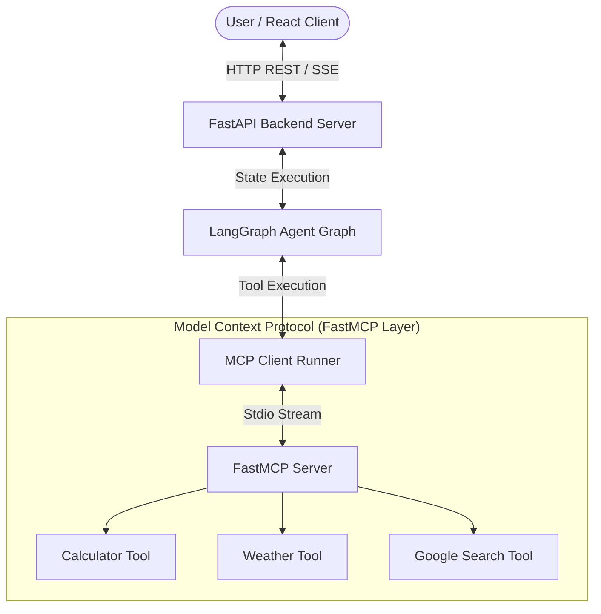

# ⚡ Aura AI Companion

A modern, intelligent, and context-aware AI companion built with **FastAPI**, **LangGraph**, **FastMCP (Model Context Protocol)**, and a glassmorphic **React (Vite)** web client.


---

## ✨ Key Features

- **⚡ FastMCP Integration**: Tools are registered and executed using Anthropic/Standard Intelligence's **FastMCP** (Model Context Protocol) over stdio.
- **🛠️ Integrated Tool Suite**:
  - **Calculator**: Arithmetic & SymPy algebraic equation solver (e.g. `(10 - 4) / 2` or `20 - (x + x + 6) = 0`).
  - **Weather Lookup**: Live weather forecasts and conditions powered by Open-Meteo API.
  - **Google Web Search**: Real-time web news, facts, and live updates using SerpAPI.
- **🧠 Resilient Agent Workflow**: Powered by **LangGraph** state machine with automatic LLM fallback routing across OpenRouter models.
- **💾 Long-Term Memory & Semantic Cache**: Asynchronous pgvector memory store and semantic response caching.
- **🎨 Glassmorphic Dark-Mode UI**: Sleek React interface displaying real-time tool invocation chips (`⚡ tool_name("args") via FastMCP`).

---

## 🏗️ System Architecture



---

## 📂 Project Structure

```
Aura/
├── aura/
│   ├── api/             # FastAPI routers and Pydantic schemas
│   ├── core/            # LangGraph state nodes, resilient LLM factory, and state graph
│   ├── memory/          # Semantic cache, store, and fact extraction
│   └── tools/           # Core tool functions (calculator, weather, search)
├── aura_mcp/
│   ├── mcp_server.py    # FastMCP server registering aura tools
│   └── mcp_client.py    # MCP client runner & execution wrapper
├── frontend/
│   ├── src/
│   │   ├── App.jsx      # Main React workspace & tool chip badges
│   │   ├── App.css      # Custom dark-mode glassmorphic styling
│   │   └── main.jsx
│   └── package.json
├── main.py              # Backend entry point
├── requirements.txt     # Python dependencies
└── README.md
```

---

## 🚀 Quick Start & Setup

### Prerequisites
- **Python 3.11+**
- **Node.js 18+** & npm
- **OpenRouter / OpenAI API Key** (and optional **SerpAPI Key**)

### 1. Installation

Clone the repository and install backend dependencies:

```bash
# Install Python packages
pip install -r requirements.txt
pip install fastmcp mcp

# Install Frontend dependencies
cd frontend
npm install
cd ..
```

### 2. Environment Setup

Create a `.env` file in the root directory:

```env
OPENROUTER_API_KEY=your_openrouter_api_key_here
SERPAPI_API_KEY=your_serpapi_key_here
PRIMARY_MODEL=openai/gpt-4o-mini
FALLBACK_MODEL=google/gemini-2.5-flash
RETRY_MODEL=deepseek/deepseek-chat
```

---

## 🧪 Testing FastMCP Standalone

You can test the FastMCP Server and Client independently to verify tool execution over Stdio:

```bash
python aura_mcp/mcp_client.py
```

*Output:*
```text
Connecting to MCP Server...
=== Registered MCP Tools ===
- calculate: Evaluate a mathematical expression.
- fetch_weather: Fetch current weather report for location.
- google_search: Search Google via SerpAPI.

--- Testing Calculator Tool via MCP ---
Output: Result: x = 10
```

---

## 💻 Running the Application

### 1. Start FastAPI Backend
From the root directory (`e:\Aura`):
```bash
python main.py
```
*Backend API runs at `http://localhost:8000`.*

### 2. Start React Frontend
In a separate terminal:
```bash
cd frontend
npm run dev
```
*Frontend app runs at `http://localhost:5173`.*

---

## 📜 License

Distributed under the MIT License.
